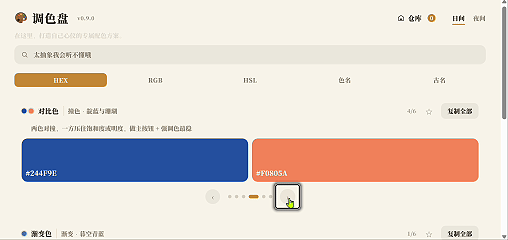
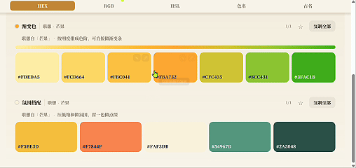
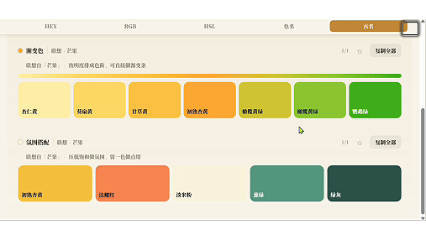

# 自在调色盘 · Free Color Palette

> **Generate design-ready color palettes from descriptive words.**  
> 给所有创作者、美术爱好者与设计师的配色工作台——一键生成你要的配色方案，通过微调，打造独属于你自己产品的氛围感配色。

**在线体验：<https://color-palette.app.workbuddy.host/>** （免注册，打开即用）

## 两种用法

**① 打开就有，直接选用。** 主页自带六组现成配色——对比色、渐变色、氛围搭配等，每组六套、可翻页、可「换一批」随机刷新。不输入任何词，也可能正好撞见心仪的一套，复制编码就能带走。

**② 输入一个词，联想三组配色。** 芒果、初雪、赛博朋克——输入什么，就围绕它联想出**对比色 / 渐变色 / 氛围搭配**三组配色，再进入微调，调成只属于你的方案。

## 五种色彩格式，任君选择

每个颜色都支持**一键复制**成五种写法，做设计、写代码、配文案都接得上（示例为同一色值的五种形态）：

| 格式     | 示例               | 顺手场景        |
| ------ | ---------------- | ----------- |
| HEX    | `#B22222`        | 网页 / UI 设计稿 |
| RGB    | `rgb(178,34,34)` | 前端开发        |
| HSL    | `hsl(0,68%,42%)` | 精确调色、造色阶    |
| CSS 色名 | `firebrick`      | 快速原型、手写样式   |
| 中国古色名  | `朱砂`             | 文案、命名、国风设计  |

## 中国风有了颜色：古色名

88 个词条全部经由中国传统色名联想链生成：月白、竹青、藕荷、缃色、黛蓝……生成的配色可以随时切换成古名显示，满屏古朴质感。专为做国风设计、给颜色起名字、写带色彩的文案服务。

苦于笔下角色衣衫色彩搭配、脑海有了颜色却不知从何说起……来这里，自定义配色，一键复制三种类型色彩名称（包括现代中英文名、中国传统命名），让你的创作色彩斑斓。

## 收藏、微调，都为「独属于你」

- **一键收藏**：心仪的方案进本地色库，随时回看、导出 JSON 带走
- **自主微调**：每个色块可调 HSL，差一点意思就自己拧到满意为止
- **吸管取色**：右上角吸管直接从屏幕任意位置取色，把别处的好颜色顺手收进来
- **近义词 + 色名联想**：凛冬→冬、寒冷→初雪；「明蓝的大海」以色名为底现场生成

## 搜不到想要的词？

在搜索框直接输就行——词典暂时没有的词，页面会先替你记下（只存在你自己的电脑里）。想让它进词典，点面板里的「去 GitHub 提交」，缺词清单会自动填好，补一句你想要的感觉就能发出去。词条按批次审核，通过后出现在下个版本——你的词，下一个人也搜得到。

## 你的色库，只在你自己的电脑里

- **零门槛**：免注册、零成本、零等待。网页打开即用；下载 `index.html` 双击也能用
- **离线运行**：88 词条中文配色词典内置在页面里，不联网照样联想
- **只存本地**：收藏入库全部只存在你自己的浏览器里，不上传任何一个字节

## 系列 · Palette 系列

| 仓库                       | 简介                                                          | 状态     |
| ------------------------ | ----------------------------------------------------------- | ------ |
| **free-color-palette**（本仓库） | Generate design-ready color palettes from descriptive words | 🟢 已上线 |
| **emoji-color-palette** | Generate design-ready color palettes from emoji             | 🚧 筹备中 |

## License

[MIT](LICENSE)
